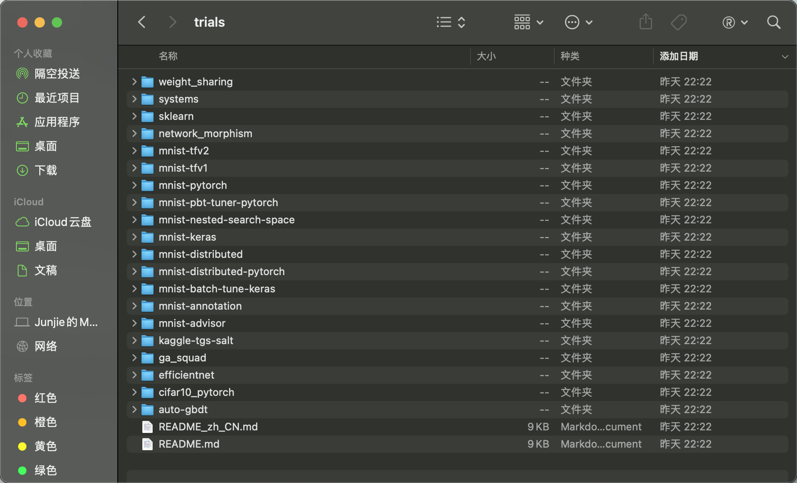

# 1NNI 使用体验文档

## 1.1工具比较

* PyBrain

PyBrain是一个Python的模块化机器学习库，其中包含用于神经网络的算法，如强化学习、无监督学习和进化等，能够为机器学习任务和各种预定义环境提供灵活、强大的算法支撑。

该库适用于处理涉及连续状态和动作空间的多维问题，其使用函数逼近器即神经网络将所有训练方法作为待训练实例。且PyBrain非常易用，不仅适合入门人员也能够为研究提供灵活、高效的算法。

* Milk

Milk同样是Python的机器学习工具包，其偏向于有多种分类器的监督分类，如SVM(基于libsvm)、k-NN、随机森林、决策树、自我组织地图、特征选择的分步判别分析、亲和力传播等，这些分类器还可以以多种方式组成不同的分类系统。

其输入相当灵活，支持数值库numpy以及很多的基本库，非常强调速度和低内存使用，大部分代码都是以C++方式实现的。

* Amazon SageMaker

Amazon SageMaker是一个完全托管的开源学习工具，能够提供快速构建、训练和部署机器学习的能力，同时开发者能够在一个集成的可视化界面中编写、跟踪代码、可视化数据以及进行调试和监控等。其具有完整的平台IDE、具体代码与API，简洁易用，这是第一个用于机器学习的完全集成式开发环境 (IDE)  单一集成的可视界面操作。

## 1.2安装使用

```
NNI version :1.9-10/22/2020

environment:MAC OS Big Sur 11.2

conda version:4.9.2

Python version:3.8.5

tensorflow version:2.x
```

安装步骤：

1. 安装anaconda，在官方网站https://www.anaconda.com/products/individual#Downloads下载MAC OS版本软件并安装。
2. MAC OS通过homebrew安装python3，命令为

```
brew install python3
```

安装成功后可以查看python版本`python3 --version`。

3. 安装tensorflow，在安装tensorflow之前需要先更新pip3版本，命令为

```
pip3 install --upgrade pip
```

在完成更新后，可以开始安装tensorflow，命令为

```
pip3 install tensorflow
```

此时可以看到tensorflow的版本为2.0。

4. 安装NNI，命令为

```
git clone -b v1.9 https://github.com/Microsoft/nni.git
```

此时应特别注意，我们安装的是tensorflow是2.x版本的，而NNI安装教程使用的是1.x版本的tensorflow，因此在运行experiment时因特别注意，否则在tensorflow中将会出现找不到examples等文件的报错。

5. 此时NNI已经安装完毕，可以进行样例的测试，但如4所述，应特别文件描述，如下：

```
nnictl create --config nni/examples/trials/mnist-tfv2/config.yml
```

其中mnist-tfv1改成了mnist-tfv2，折腾了许久。

## 1.3一些建议

NNI在从github拉取下来的文件中，在文件nni/examples/trials/中通过观察可以看到其实不止一种运行测试，如图所示：



其中以mnist开头的都是都是能够以不同的平台运行的样例，如本次NNI安装教程的话就会遇到很多文件、模块不存在的报错，其中mnist-tfv2和mnist-tfv1就是一个很好的例子，因此可以在NNI安装教程中描述再详细些，这样也能够避免安装时出现不必要的错误，进而折腾很久。


