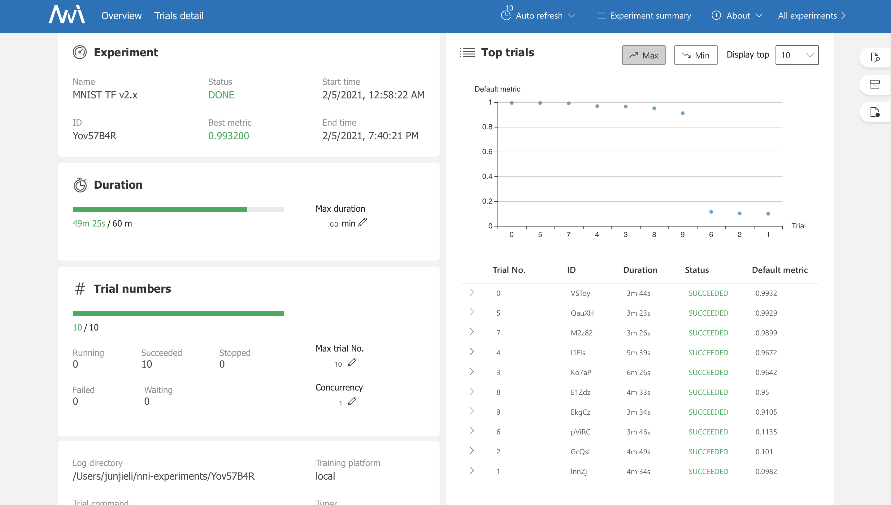
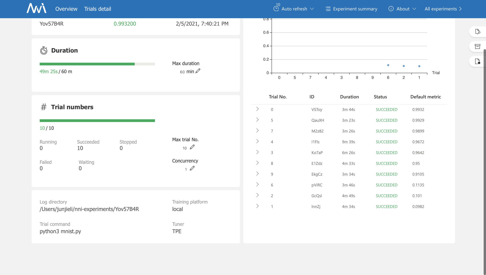
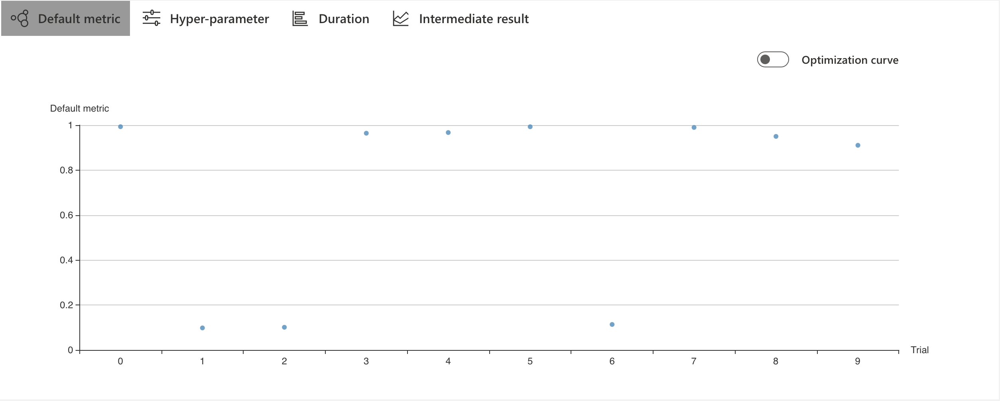
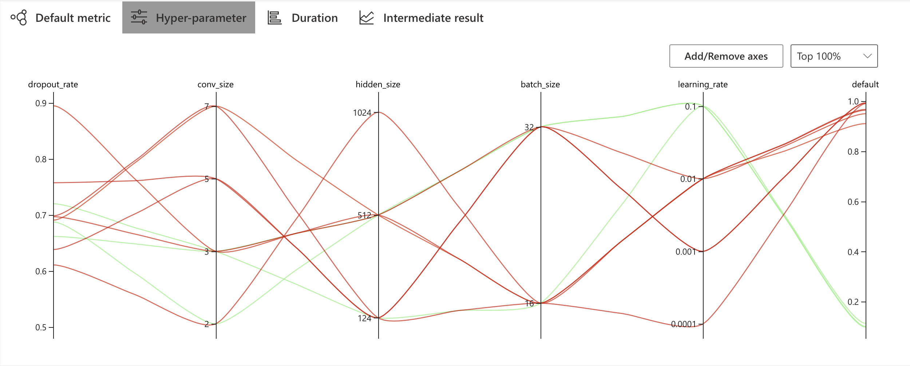
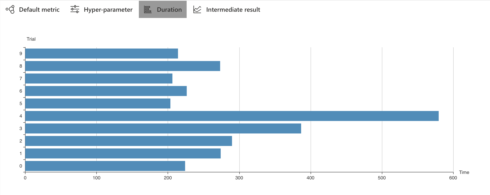
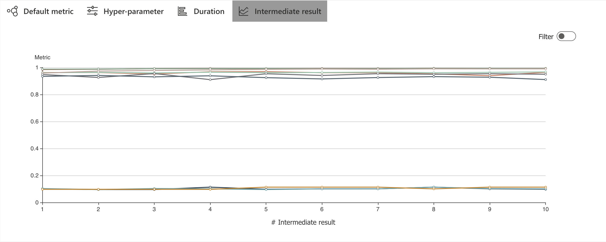
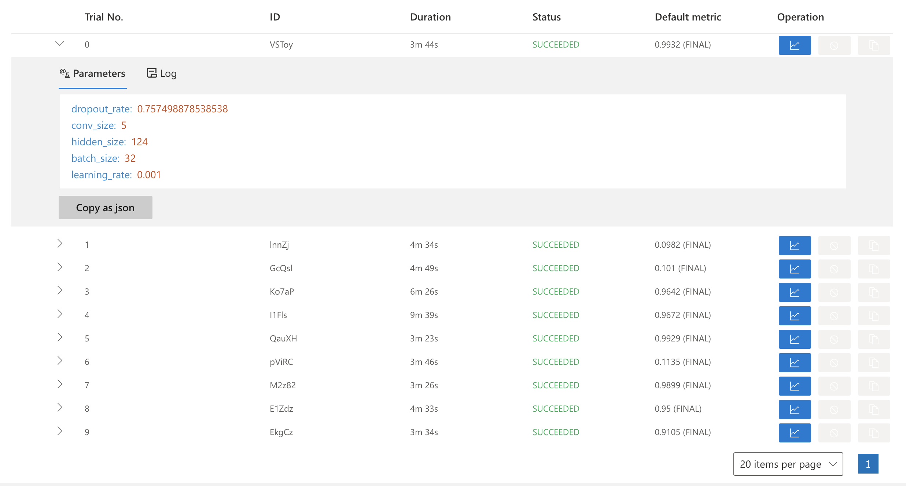

# 2NNI样例分析文档

```
NNI version :1.9-10/22/2020

environment:MAC OS Big Sur 11.2

conda version:4.9.2

Python version:3.8.5

tensorflow version:2.x
```

## 2.1配置文件

config.yaml路径:`nni/examples/trials/mnist-tfv2/config.yml`

```
authorName: NNI Example
experimentName: MNIST TF v2.x
trialConcurrency: 1
maxExecDuration: 1h
maxTrialNum: 10
trainingServicePlatform: local  # choices: local, remote, pai
searchSpacePath: search_space.json
useAnnotation: false
tuner:
    builtinTunerName: TPE   # choices: TPE, Random, Anneal, Evolution, BatchTuner, MetisTuner,
                            #          GPTuner, SMAC (SMAC should be installed through nnictl)
    classArgs:
        optimize_mode: maximize  # choices: maximize, minimize
trial:
  command: python3 mnist.py
  codeDir: .
  gpuNum: 0

```

## 2.2代码

search_space.json路径:`nni/examples/trials/mnist-tfv2/search_space.json`

```
{
    "dropout_rate": { "_type": "uniform", "_value": [0.5, 0.9] },
    "conv_size": { "_type": "choice", "_value": [2, 3, 5, 7] },
    "hidden_size": { "_type": "choice", "_value": [124, 512, 1024] },
    "batch_size": { "_type": "choice", "_value": [16, 32] },
    "learning_rate": { "_type": "choice", "_value": [0.0001, 0.001, 0.01, 0.1] }
}

```

## 2.3实现

终端运行命令

```
nnictl create --config nni/examples/trials/mnist-tfv2/config.yml
```

## 2.4结果

* Overview






* Trials Detail

  * Default Metric

  
  * Hyper-parameter

  

  * Duration

  

  * Intermediate result

  

  * Trial jobs

  

