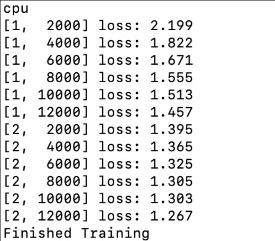

## Task 2.1 NNI 进阶任务Advanced tasks

* 访问 [Python机器学习库网站](https://pytorch.org/tutorials/beginner/blitz/cifar10_tutorial.html)
* 完成初级任务：Training a classifier

### 任务说明
* 以CIFAR10为样例，通过图像分类，训练小型神经网络，加深同学对PyTorch Tensor Library和神经网络的理解，帮助初级同学补充机器学习相关的背景知识；
* 提交相关文档，包括配置文件、代码、实现、结果。

### 任务步骤
本文档为CIFAR10图像分类样例分析报告，具体内容包括
1. CIFAR10简介
2. 加载和规范化CIFAR10训练和测试数据集 `torchvision`。
3. 定义卷积神经网络
4. 定义损失函数
5. 根据训练数据训练网络
6. 在测试数据上测试网络
7. 在GPU上进行上述操作

#### 1 CIFAR10简介

CIFAR10，该数据集共有60000张彩色图像，这些图像是32* 32* 3（记住这个32*32很重要），分为10个类，每类6000张图。这里面有50000张用于训练，构成了5个训练批，每一批10000张图；另外10000用于测试，单独构成一批。测试批的数据里，取自10类中的每一类，每一类随机取1000张。抽剩下的就随机排列组成了训练批。注意一个训练批中的各类图像并不一定数量相同，总的来看训练批，每一类都有5000张图。

在本教程中，我们将使用CIFAR10数据集，它包含以下类：‘airplane’, ‘automobile’, ‘bird’, ‘cat’, ‘deer’,‘dog’, ‘frog’, ‘horse’, ‘ship’, ‘truck’。示意图如下所示：


#### 2 加载和初始化CIFAR10训练和测试数据集torchvision

##### 2.1 加载和初始化数据
使用torchvision装载CIFAR10非常容易

``` python
import torch
import torchvision
import torchvision.transforms as transforms
transform = transforms.Compose(
    [transforms.ToTensor(),
     transforms.Normalize((0.5, 0.5, 0.5), (0.5, 0.5, 0.5))])

trainset = torchvision.datasets.CIFAR10(root='./data', train=True,
                                        download=True, transform=transform)
trainloader = torch.utils.data.DataLoader(trainset, batch_size=4,
                                          shuffle=True, num_workers=2)

testset = torchvision.datasets.CIFAR10(root='./data', train=False,
                                       download=True, transform=transform)
testloader = torch.utils.data.DataLoader(testset, batch_size=4,
                                         shuffle=False, num_workers=2)

classes = ('plane', 'car', 'bird', 'cat',
           'deer', 'dog', 'frog', 'horse', 'ship', 'truck')
```
另外需要注意的是由于torchvision输出的数据集是[0,1]的PILImage图像，我们将其转化为归一化范围为[-1,1]的tensor。

##### 2.2 输出
``` shell
Downloading https://www.cs.toronto.edu/~kriz/cifar-10-python.tar.gz to ./data/cifar-10-python.tar.gz
Extracting ./data/cifar-10-python.tar.gz to ./data
Files already downloaded and verified
```

##### 2.3 展示训练图片
``` python
import matplotlib.pyplot as plt
import numpy as np

# functions to show an image


def imshow(img):
    img = img / 2 + 0.5     # unnormalize
    npimg = img.numpy()
    plt.imshow(np.transpose(npimg, (1, 2, 0)))
    plt.show()


# get some random training images
dataiter = iter(trainloader)
images, labels = dataiter.next()

# show images
imshow(torchvision.utils.make_grid(images))
# print labels
print(' '.join('%5s' % classes[labels[j]] for j in range(4)))
```


#### 3 定义并初始化卷积神经网络
从前面的“神经网络”部分复制神经网络，并将其修改为生成3通道图像（而不是定义的单通道图像）。

``` python
import torch.nn as nn
import torch.nn.functional as F


class Net(nn.Module):
    def __init__(self):
        super(Net, self).__init__()

        # 定义conv1函数的是图像卷积函数：输入为图像（3个频道，即RGB图）,输出为6张特征图, 卷积核为5x5正方形
        self.conv1 = nn.Conv2d(3, 6, 5)
        self.pool = nn.MaxPool2d(2, 2)

        # 定义conv2函数的是图像卷积函数：输入为6张特征图,输出为16张特征图, 卷积核为5x5正方形
        self.conv2 = nn.Conv2d(6, 16, 5)

        # 定义fc1（fullconnect）全连接函数1为线性函数：y = Wx + b，并将16*5*5个节点连接到120个节点上。
        self.fc1 = nn.Linear(16 * 5 * 5, 120)

        # 定义fc2（fullconnect）全连接函数2为线性函数：y = Wx + b，并将120个节点连接到84个节点上。
        self.fc2 = nn.Linear(120, 84)

        # 定义fc3（fullconnect）全连接函数3为线性函数：y = Wx + b，并将84个节点连接到10个节点上。
        self.fc3 = nn.Linear(84, 10)

    def forward(self, x):
        x = self.pool(F.relu(self.conv1(x)))
        x = self.pool(F.relu(self.conv2(x)))
        x = x.view(-1, 16 * 5 * 5)
        x = F.relu(self.fc1(x))
        x = F.relu(self.fc2(x))
        x = self.fc3(x)
        return x


net = Net()

```

#### 4 定义损失函数与优化器
让我们使用分类交叉熵损失和SGD与动量。
``` python
import torch.optim as optim

criterion = nn.CrossEntropyLoss()
optimizer = optim.SGD(net.parameters(), lr=0.001, momentum=0.9)
```

#### 5 训练网络
当我们开始循环时，我们就开始优化我们的数据。
``` python
for epoch in range(2):  # loop over the dataset multiple times

    running_loss = 0.0
    for i, data in enumerate(trainloader, 0):
        # get the inputs; data is a list of [inputs, labels]
        inputs, labels = data

        # zero the parameter gradients
        optimizer.zero_grad()

        # forward + backward + optimize
        outputs = net(inputs)
        loss = criterion(outputs, labels)
        loss.backward()
        optimizer.step()

        # print statistics
        running_loss += loss.item()
        if i % 2000 == 1999:    # print every 2000 mini-batches
            print('[%d, %5d] loss: %.3f' %
                  (epoch + 1, i + 1, running_loss / 2000))
            running_loss = 0.0

print('Finished Training')
```

训练结果为：


#### 6 测试效果

我们已经在训练数据集中对网络进行了2次训练。但是我们需要检查网络是否学到了什么。我们将通过预测神经网络输出的类标签并根据实际情况进行检查来。如果预测正确，则将样本添加到正确预测列表中。
好的，第一步。让我们显示测试集中的图像以使其熟悉，同时保存我们的模型。

##### 6.1 测试代码

``` python
dataiter = iter(testloader)
images, labels = dataiter.next()

# print images
imshow(torchvision.utils.make_grid(images))
print('GroundTruth: ', ' '.join('%5s' % classes[labels[j]] for j in range(4)))
net = Net()
net.load_state_dict(torch.load(PATH))
```

之后看看该网络在整个数据集上的表现

``` python
correct = 0
total = 0
with torch.no_grad():
    for data in testloader:
        images, labels = data
        outputs = net(images)
        _, predicted = torch.max(outputs.data, 1)
        total += labels.size(0)
        correct += (predicted == labels).sum().item()

print('Accuracy of the network on the 10000 test images: %d %%' % (
    100 * correct / total))
```

最后看看该网络在哪些类上具有较高正确率，而哪些类较低

``` python
class_correct = list(0. for i in range(10))
class_total = list(0. for i in range(10))
with torch.no_grad():
    for data in testloader:
        images, labels = data
        outputs = net(images)
        _, predicted = torch.max(outputs, 1)
        c = (predicted == labels).squeeze()
        for i in range(4):
            label = labels[i]
            class_correct[label] += c[i].item()
            class_total[label] += 1


for i in range(10):
    print('Accuracy of %5s : %2d %%' % (
        classes[i], 100 * class_correct[i] / class_total[i]))
  

```

##### 6.2 训练结果


#### 7 GPU版本

##### 7.1 采用GPU之前的代码

详情请见code文件夹CIFAR10_NO_GPU.py

##### 7.2 采用GPU之前的代码运行结果


##### 7.3 采用GPU之后的代码

详情请见code文件夹中CIFAR10_USE_GPU.py

##### 7.4 采用GPU之后的代码运行结果


##### 7.5实验结果分析

实验结果发现，有无GPU的版本在运行时间上几乎相差无几，GPU版本仅仅是在准确率上稍微优于无GPU版本。

可能的原因是：我们发现运行过程中，由于该网络过于简单，且GPU的内存占有率并不高，导致这两个版本并没有体现出明显的差异。