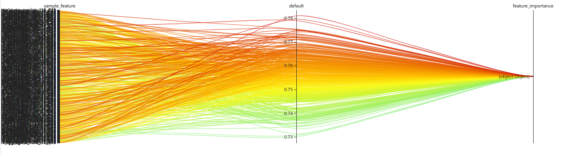

## Task 3.1 NNI Feature Engineering Sample

* 跑通 NNI [Feature Engineering Sample](https://github.com/SpongebBob/tabular_automl_NNI)

### 1. 特征工程简介

有这么一句话在业界广泛流传：**对于一个机器学习问题，数据和特征决定了机器学习的上限，而模型和算法只是逼近这个上限而已**。

特征工程，顾名思义，是对原始数据进行一系列工程处理，将其提炼为特征，作为输入供算法和模型使用。从本质上来讲，特征工程是一个表示和展现数据的过程。在实际工作中，特征工程旨在去除原始数据中的杂质和冗余，设计更高效的特征以刻画求解的问题与预测模型之间的关系。

### 2. 自动化特征工程简介

自动化特征工程是旨在通过从数据集中自动创建候选特征，且从中选择若干最佳特征进行训练的一种方式。

利用NNI中的特征工程工具，我们能够方便地实现特征工程的自动调优。

### 3. NNI特征工程样例

#### 3.1 配置文件

* 配置搜索空间：

  ```json
  {
  
      "count":[
  
          "C1","C2","C3","C4","C5","C6","C7","C8","C9","C10",
  
          "C11","C12","C13","C14","C15","C16","C17","C18","C19",
  
          "C20","C21","C22","C23","C24","C25","C26"
  
      ],
  
      "aggregate":[
  
          ["I9","I10","I11","I12"],
  
          [
  
              "C1","C2","C3","C4","C5","C6","C7","C8","C9","C10",
  
              "C11","C12","C13","C14","C15","C16","C17","C18","C19",
  
              "C20","C21","C22","C23","C24","C25","C26"
  
          ]
  
      ],
  
      "crosscount":[
  
          [
  
              "C1","C2","C3","C4","C5","C6","C7","C8","C9","C10",
  
              "C11","C12","C13","C14","C15","C16","C17","C18","C19",
  
              "C20","C21","C22","C23","C24","C25","C26"
  
          ],
  
          [
  
              "C1","C2","C3","C4","C5","C6","C7","C8","C9","C10",
  
              "C11","C12","C13","C14","C15","C16","C17","C18","C19",
  
              "C20","C21","C22","C23","C24","C25","C26"
  
          ]
  
      ]
  
  }
  ```

* 配置实验：

  ```
  authorName: default
  
  experimentName: example-auto-fe
  
  trialConcurrency: 1
  
  maxExecDuration: 10h
  
  maxTrialNum: 2000
  
  #choice: local, remote
  
  trainingServicePlatform: local
  
  searchSpacePath: search_space.json
  
  #choice: true, false
  
  useAnnotation: false
  
  tuner:
  
    codeDir: .
  
    classFileName: autofe_tuner.py
  
    className: AutoFETuner
  
    classArgs:
  
      optimize_mode: maximize
  
  trial:
  
    command: python3 main.py
  
    codeDir: .
  
    gpuNum: 0
  
  ```

#### 3.2 实验结果

* **Top 10 Trails：**

  

* **Default Metric：**

  

* **Hyper-parameter：**

  

  

### 4. Titanic数据集运行结果

[Titanic ML competition](https://www.kaggle.com/c/titanic) 是数据科学竞赛平台Kaggle上的一个入门的ML比赛，主要是让参赛选手根据训练集中的乘客数据和存活情况进行建模，进而使用模型预测测试集中的乘客是否会存活。

乘客特征总共有11个：

- PassengerId => 乘客ID
- Pclass => 客舱等级(1/2/3等舱位)
- Name => 乘客姓名
- Sex => 性别
- Age => 年龄
- SibSp => 兄弟姐妹数/配偶数
- Parch => 父母数/子女数
- Ticket => 船票编号
- Fare => 船票价格
- Cabin => 客舱号
- Embarked => 登船港口

我们希望通过特征工程，从数据中挖掘出乘客特征与存活概率的相关性，为实现更好的预测模型打下基础。

#### 4.1 配置文件

* **配置搜索空间：**

  ```json
  {
      "count":[
          "Pclass","Name","Sex","Age","SibSp","Parch","Ticket","Cabin","Embarked"
      ],
      "aggregate":[
          [
              "Fare"
          ],
          [
              "Pclass","Name","Sex","Age","SibSp","Parch","Ticket","Cabin","Embarked"
          ]
      ],
      "crosscount" :[
          [
              "Pclass","Name","Sex","Age","SibSp","Parch","Ticket","Cabin","Embarked"
          ],
          [
              "Pclass","Name","Sex","Age","SibSp","Parch","Ticket","Cabin","Embarked"
          ]
      ]
  }
  ```

* **配置实验：**

  ```
  authorName: default
  experimentName: example-auto-fe
  trialConcurrency: 1
  maxExecDuration: 10h
  maxTrialNum: 2000
  #choice: local, remote
  trainingServicePlatform: local
  searchSpacePath: search_space.json
  #choice: true, false
  useAnnotation: false
  tuner:
    codeDir: ../../
    classFileName: autofe_tuner.py
    className: AutoFETuner
    classArgs:
      optimize_mode: maximize
  trial:
    command: python3 main.py
    codeDir: .
    gpuNum: 0
  ```

#### 4.2 实验结果

* **Top 10 Trails：**

  

* **Default Metric：**

  

* **Hyper-parameter：**

  

* **Sample Features Of Top 1 Trial：**

  ```
  {
      "sample_feature": [
          "aggregate_mean_Fare_Sex",
          "crosscount_Embarked_Sex",
          "aggregate_max_Fare_Cabin",
          "crosscount_Cabin_Ticket",
          "aggregate_max_Fare_Age",
          "crosscount_Name_Sex",
          "crosscount_Parch_Sex",
          "crosscount_Age_Sex",
          "crosscount_Age_Ticket",
          "crosscount_Cabin_Sex",
          "crosscount_Sex_Ticket",
          "crosscount_Pclass_Sex",
          "aggregate_max_Fare_Ticket",
          "crosscount_Embarked_Ticket",
          "aggregate_var_Fare_Age",
          "aggregate_var_Fare_Ticket",
          "aggregate_min_Fare_Sex",
          "crosscount_Cabin_Pclass",
          "aggregate_median_Fare_Embarked",
          "crosscount_Sex_Ticket",
          "aggregate_var_Fare_Name",
          "aggregate_min_Fare_Ticket",
          "aggregate_var_Fare_Sex",
          "crosscount_Name_Parch",
          "crosscount_Age_Name",
          "crosscount_Name_Pclass",
          "crosscount_Name_Ticket",
          "aggregate_median_Fare_Pclass",
          "aggregate_median_Fare_Age",
          "aggregate_median_Fare_Cabin",
          "aggregate_mean_Fare_Age",
          "aggregate_max_Fare_Parch",
          "aggregate_max_Fare_Sex",
          "aggregate_var_Fare_Pclass",
          "crosscount_Embarked_Pclass",
          "crosscount_Embarked_Sex",
          "aggregate_max_Fare_Name",
          "aggregate_mean_Fare_Name",
          "aggregate_median_Fare_Ticket",
          "crosscount_Pclass_Sex",
          "aggregate_median_Fare_Name",
          "aggregate_mean_Fare_Embarked",
          "aggregate_mean_Fare_SibSp",
          "crosscount_Cabin_Embarked",
          "crosscount_Age_Sex",
          "aggregate_median_Fare_Sex",
          "crosscount_Name_Sex",
          "crosscount_Cabin_Ticket",
          "aggregate_max_Fare_Pclass",
          "crosscount_Sex_SibSp",
          "crosscount_Embarked_Name",
          "crosscount_Embarked_Ticket",
          "aggregate_min_Fare_Pclass",
          "crosscount_Age_Embarked",
          "aggregate_max_Fare_Embarked",
          "crosscount_Age_Pclass",
          "aggregate_min_Fare_Parch",
          "crosscount_Age_Ticket",
          "aggregate_var_Fare_Embarked",
          "crosscount_Name_Ticket",
          "crosscount_SibSp_Ticket",
          "aggregate_mean_Fare_Ticket",
          "crosscount_Age_Embarked",
          "crosscount_Cabin_Sex",
          "count_Age",
          "crosscount_Age_Cabin",
          "crosscount_Parch_Pclass",
          "crosscount_Sex_SibSp",
          "aggregate_var_Fare_Cabin",
          "crosscount_Age_Name",
          "crosscount_Age_Parch",
          "aggregate_median_Fare_Parch",
          "aggregate_min_Fare_Age",
          "crosscount_SibSp_Ticket",
          "aggregate_min_Fare_SibSp"
      ]
  }
  ```

  