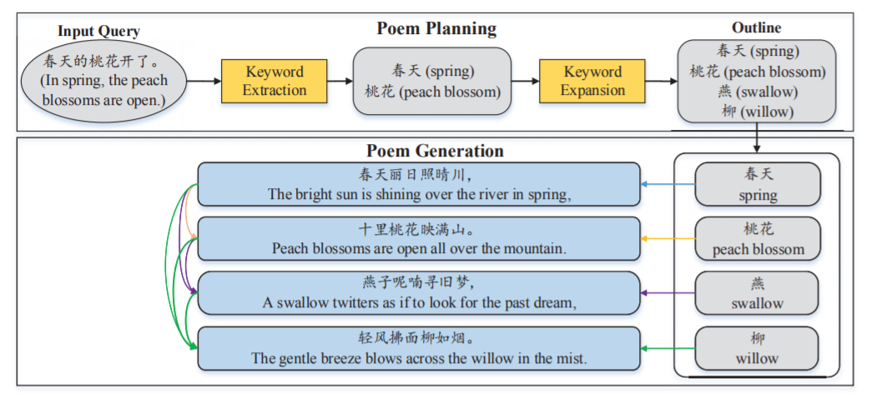

## Task4 项目启动报告

### 1. 项目简介

本小组的自主项目主题是**基于RNN的AI古诗词生成模型**。

这是我们小组的一个SITP(Students Innovation Training Program)项目的一个模块，目前该模块已基本完成，但效果不理想，我们希望将其与NNI相结合来进一步优化。

本项目基于github上的开源项目[Planning-based Poetry Generation](https://github.com/DevinZ1993/Chinese-Poetry-Generation)，基于NLP算法和RNN模型的古诗词生成流程如下：

1. 输入一个句子
2. 对输入的句子进行分词处理，提取关键词
3. 进行关键词扩展，每句诗对应到一个关键词
4. 将关键词输入的RNN模型中，每句诗由前一句诗和这句诗对应的关键词决定

如下图所示：

### 2. 项目目标

将NNI与古诗词生成模型相结合，进一步优化模型生成的古诗词的流畅性、可读性。

### 3. 项目规划

项目主要规划如下：

1. 将NNI结合到已有的代码中，对RNN模型部分进行超参调优，训练出效果更好的模型
2. 进一步对网络结构进行改进，利用NNI进行神经架构搜索，找到更好的网络架构
3. 改进现有算法，生成更多种类的诗词

### 4. 实施方案

大体的实施方案是将NNI运用于RNN模型的超参调优和神经架构搜索中，在已有模型的基础上进一步优化模型，达到更好的古诗词生成效果。

### 5. 项目进展

目前已实现了基本的古诗词生成模型，后续会将实现代码上传到该仓库中。